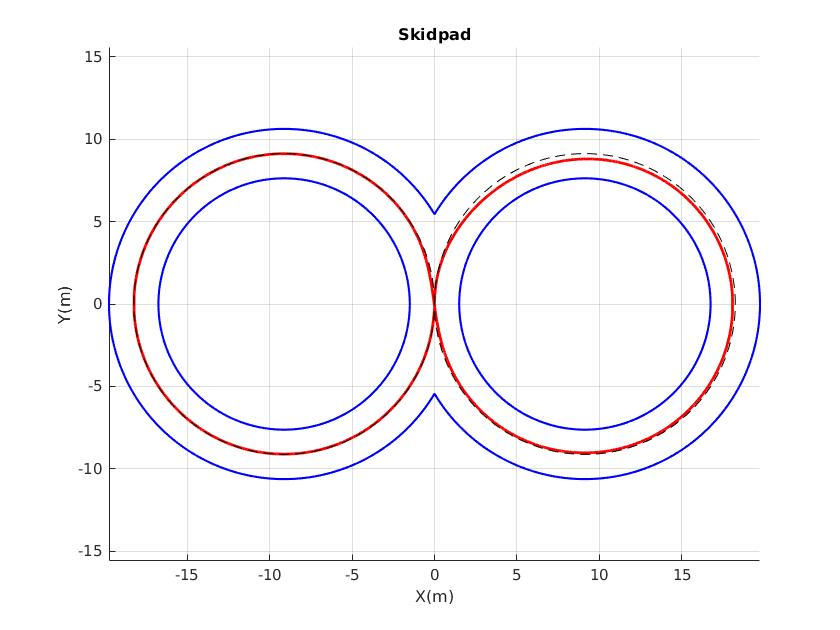
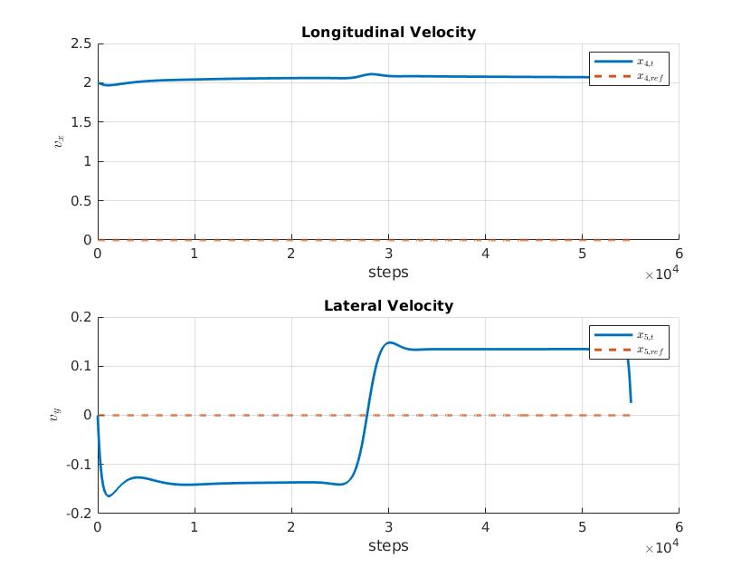
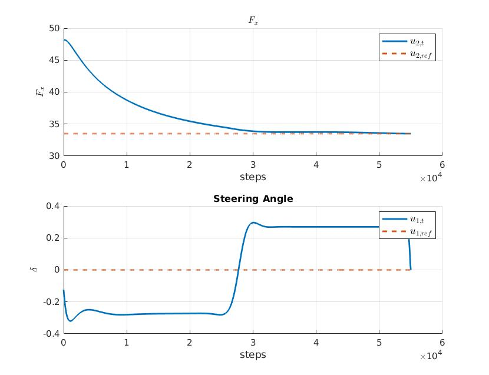
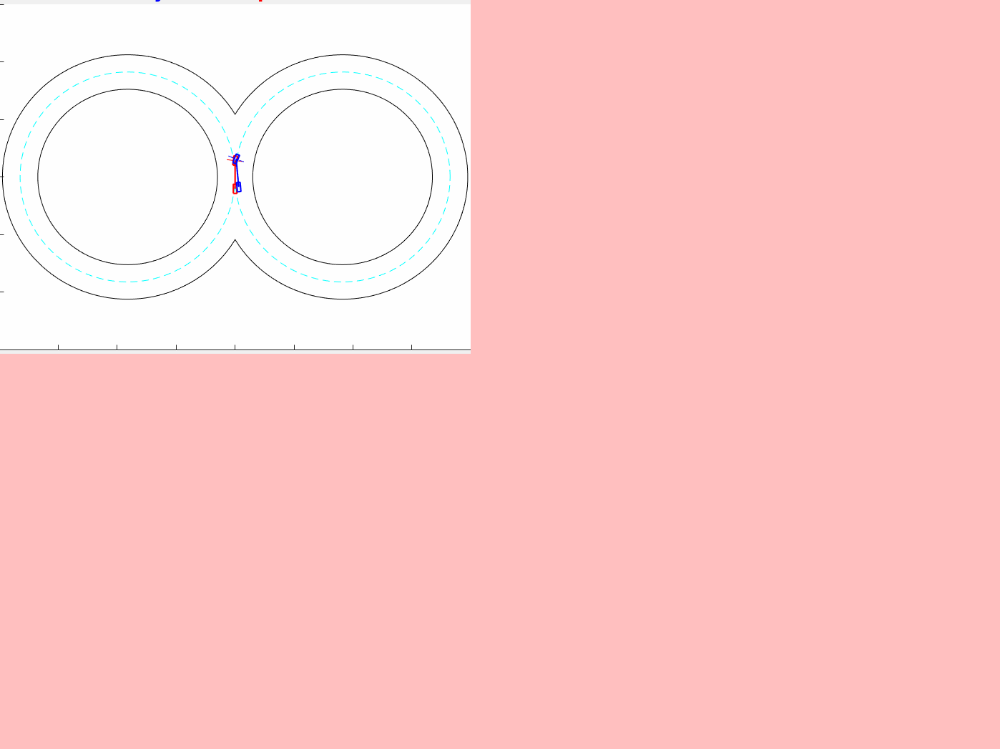

# Bicycle Model Optimal Control - Lane change manuevering and Skidpad

This project was delivered as part of  the **Optimal Control** course held by professor Notarstefano at University of Bologna.

The related task description can be read [here](http://github.com/aleegeco/Bicycle-model-Optimal-Control/blob/main/main_vehicle.pdf)

The report where we discuss in detail all the results can be read [here](http://github.com/aleegeco/Bicycle-model-Optimal-Control/blob/main/Report_Optimal_Control_Bicycle_Model_CecconiBugoFrangiamone.pdf)

The discretized dynamic bicycle model used for this project is ill-defined for low velocities, because of the way in which the slip angles are defined (*see the task description*). In particular the longitudinal velocity can never be zero.
As a consequence, all the tasks are initiliazed assuming that our car is moving. It is not a strong assumption even in the case of the skidpad if we are not considering particular racing cases. 

## Lane Change Maneuver ##
In this task, we defined a linear transition between two supposed equilibria simulating an ideal change of lane in an highway. In order to do that the implemented algorithm is the Differential Dynamic Programming. Here some plots of the results:

 

## Skidpad ##
Here we were asked to perform a skidpad track layout by imposing as reference a the middle-line of the skidpad.
In our formulation we did not introduce as state constraints the track layout, so we have chosen a conservative approach for what concern the trajectory tracking by being as close as possible to the reference centerline. The main drawback is the velocity obtained, since we imposed a time-constraints instead using a velocity profile generated reference trajectory.

  

## LQR Tracking and Animation ##
Finally, the optimal trajectory found (*in an open-loop fashion*) must be tracked by using a feedback controller and we used a Linear Quadratic Regulator to do that. We also introduce some noise to test the "robustness" of the controller and plot the results in a simple animation. The blue car is the noisy, the red the optimal one.

